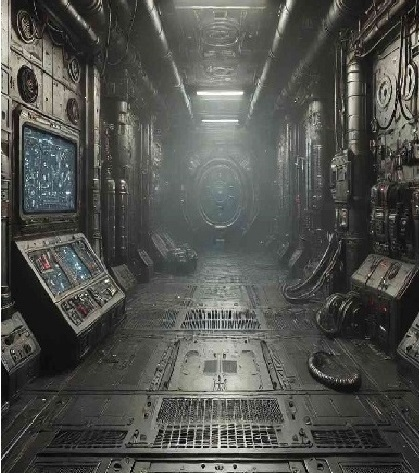
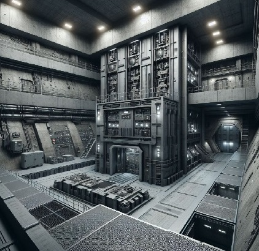

# 12-Miles.github.io
<!DOCTYPE html>
<html lang="en">
<head>
    <meta charset="UTF-8">
    <meta name="viewport" content="width=device-width, initial-scale=1.0">
    <title>12 Miles Below</title>
    <link rel="stylesheet" href="styles.css">
    <link rel="stylesheet" href="https://cdnjs.cloudflare.com/ajax/libs/font-awesome/6.0.0-beta3/css/all.min.css">
</head>
<body>
    <header id="etusivu">
        <nav>
            <a href="https://www.amazon.com/12-Miles-Below-IV-Progression-ebook/dp/B0CRLGGF77?ref_=ast_author_dp" target="_blank">
                <i class="fas fa-moon"></i> Uusin kirja
            </a>
            <a href="README.md" target="_blank">
                <i class="fas fa-home"></i> Etusivu
            </a>
            <a href="yhteistiedot.html" target="_blank">
                <i class="fas fa-address-book"></i> Yhteistiedot
            </a>
        </nav>
    </header>

    <section class="grid-container" id="paasivu">
        

            <h2>12 Mile Below</h2>
            
Äärimmäiset pakkaset tukahduttavat maan pinnan. Muinaisten aikojen jäätyneet rakenteet ulottuvat laajojen jäätiköiden halki. Selviytyjät vartioivat tarkoin kaikkea teknologiaa, joka löydetään näiden rakenteiden sisältä. Ainoa pakotie tappavasta ilmastosta on pinnan alla, mutta se ei tarkoita, että siellä olisi turvallista... Hirviömäiset koneet piileskelevät syvyyksissä. Mielipuoliset puolijumalat käyvät sotaa niitä vastaan, kuollen yhä uudelleen, kohdellen kaikkea kuin leikkiä.

            <figure>
                
            </figure>

            <h3>Maailma</h3>
            
12 miles below maailma jakaantuu 13 tasoon. Maan pinta ja maan alla olevat kerrokset. Maailma on apokalyptinen eikä mistään löydä rauhaa. Maan pinnalla ympäristö pyrkii tappamaan kaiken elävön ja maan alla tästä vastaa koneet, joita hallinnoi rogue tekoäly.

            <figure>
                
            </figure>

            <h3>Mainonta</h3>
            
Mene lukemaan kirjailijan uusia <a href="https://www.amazon.com/12-Miles-Below-IV-Progression-ebook/dp/B0CRLGGF77?ref_=ast_author_dp">kirjoja</a>

            <figure>
                
            </figure>
        

    </section>

    <footer>
        

            

                <a href="https://www.facebook.com/"><i class="fab fa-facebook"></i></a>
                <a href="https://www.instagram.com/"><i class="fab fa-instagram"></i></a>
                <a href="https://www.youtube.com/"><i class="fab fa-youtube"></i></a>
            

        

        

            
&copy; 2024 Designed by Valtteri

        

        

            
<a href="mailto:valtteri.lassas@gmail.com">valtteri.lassas@gmail.com</a>

        

    </footer>
</body>
</html>